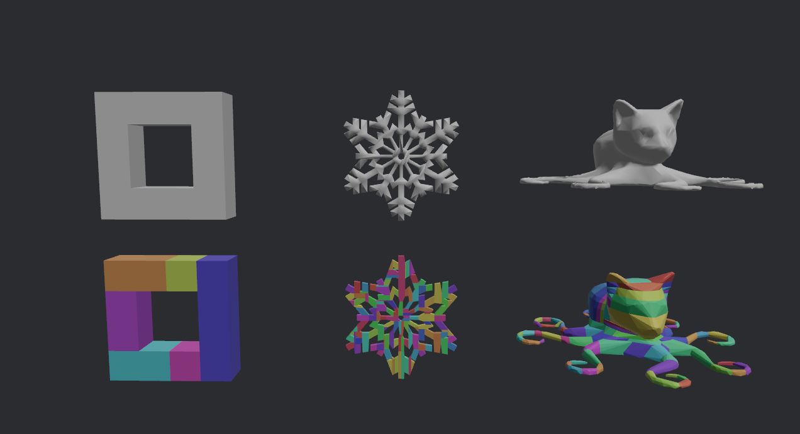

# CoACD

A Rust implementation of [Approximate Convex Decomposition for 3D Meshes with Collision-Aware Concavity and Tree Search][1] by Xinyue Wei, Minghua Liu, Zhan Ling, and Hao Su.



[1]: https://colin97.github.io/CoACD/

## Warning

This is a work-in-progress! The core algorithm has been implemented and is functional,
but some pre- and postprocessing options may be broken, APIs and documentation are not finished,
and there are optimizations to be made.

## What is CoACD?

Many efficient geometry processing algorithms require convex shapes, for example in collision detection.
Concave shapes are thus typically *decomposed* into convex parts using a convex decomposition algorithm.
Exact convex decomposition is slow and tends to produce too many small parts for real-time applications,
so approximate convex decomposition (ACD) is used instead.

**CoACD** is an approximate convex decomposition algorithm that uses a "collision-aware" concavity metric
and a multi-step tree search to decompose a mesh by recursively cutting it into smaller pieces.
It preserves collision conditions of the input shape better and with fewer components than methods
such as [V-HACD](https://github.com/Unity-Technologies/VHACD), making it a great fit for games
and other applications that require delicate and efficient object interactions.

## Features

- Approximate convex decomposition for 3D meshes
- Mesh clipping using planes
- Mesh boundary sampling
- Haussdorff distance computation for meshes
- Principal Component Analysis (PCA) for point clouds

## Examples

The [`/examples`](/examples) directory contains some examples that can be run using the following command:

```shell
cargo run --example <EXAMPLE_NAME>
```

These examples use [Bevy](https://bevy.org/) for rendering and interactivity, and are primarily intended
to showcase the capabilities of the library, not how to use the APIs.

## Limitations

- Input meshes must be manifold. No preprocessing is provided for this yet.
- Convex hull merging is not yet fully functional, and should be disabled.
  This can be seen in the earlier image with the rectangular ring. It will be fixed in the future.
- Currently, non-deterministic RNG is used. This will be made deterministic in the future.
- Results are not identical to the [C++ implementation](https://github.com/SarahWeiii/CoACD).
  This is expected, as many implementation details are different.
- Unlike the C++ implementation, we don't provide a runnable binary application yet.
  Instead, you must use this as a library.
